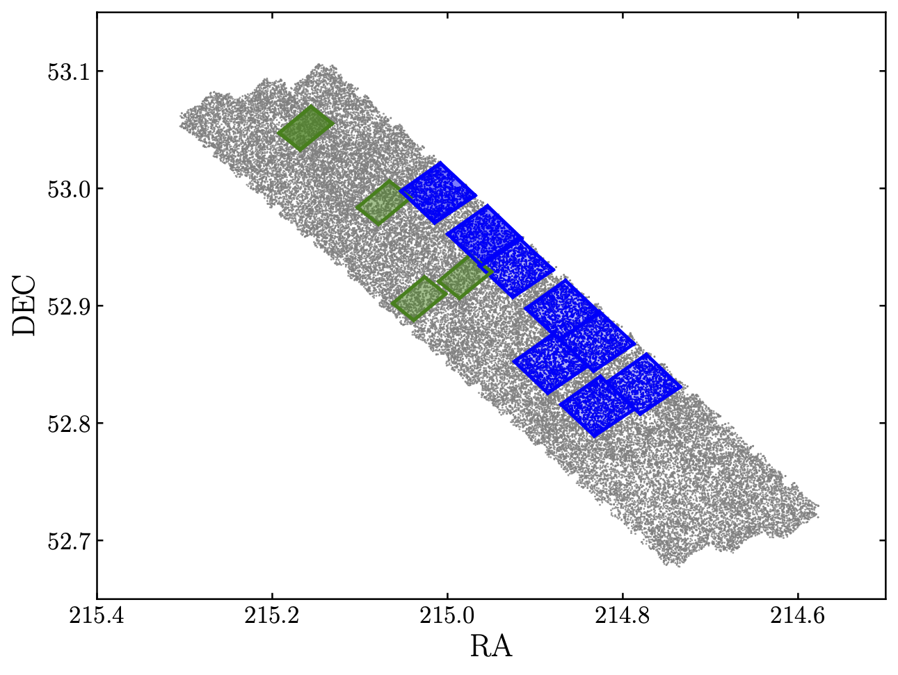

This repository contains results from fitting the `Stefanon et al. (2017) <https://arxiv.org/abs/1703.05768>`_ CANDELS EGS catalogue with the `Bagpipes <https://bagpipes.readthedocs.io>`_ spectral fitting code.

The output catalogues can be found under fitting/pipes/cats, full posterior distributions are available upon request, running to about 10 GB per run.

Input assumptions can be found in the python files under fitting, the run with redshifts free to vary is complete, the run with redshifts fixed to the CANDELS values is still in progress.

These results were generated with BAGPIPES v0.8.8, and are fully reproducible with the code provided in this repository.

Please cite `Carnall et al. (2018) <https://arxiv.org/abs/1712.04452>`_ for use of these results, and feel free to get in touch for assistance.

A subset of these objects will be observed by `JWST CEERS <https://ceers.github.io>`_. The below shows the first data to be released this week, with NIRCam in blue and MIRI in green.

